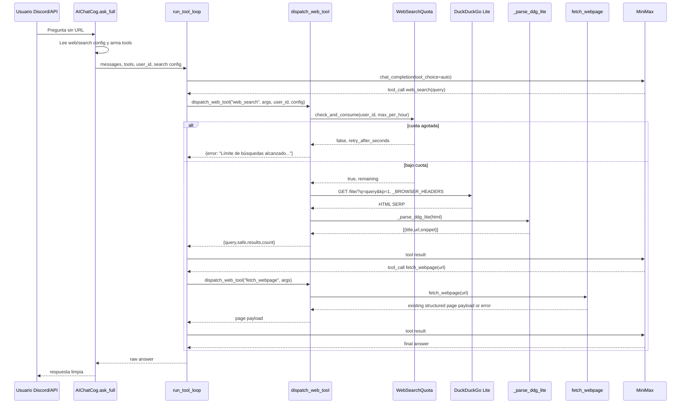

# Design — `ai-web-search`

## 1. Overview & architecture

Add `web_search` as a sibling web tool to the existing `fetch_webpage` implementation inside `src/bot/plugins/ai_chat/web.py`. The tool loop remains the same OpenAI-compatible MiniMax tool-calling loop; the only routing change is passing caller context and admin search config through the existing web-dispatch branch.

```
Discord/API user
    │ user_id, prompt
    ▼
AIChatCog.ask_full()
    │ builds messages + active tool schemas
    │ passes user_id + search config
    ▼
run_tool_loop(..., user_id=..., search_enabled=..., search_safe=..., search_max_per_hour=...)
    │
    ├─ Discord tool name ───────────────► DiscordTools.dispatch(...)
    │
    └─ name in WEB_TOOL_NAMES ──────────► dispatch_web_tool(...)
                                           │
                                           ├─ fetch_webpage(url)
                                           │   └─ existing SSRF guard + httpx/browser fetch
                                           │
                                           └─ web_search(query)
                                               ├─ WebSearchQuota.check_and_consume(user_id)
                                               ├─ httpx GET https://lite.duckduckgo.com/lite/?q=...&kp=1
                                               ├─ _parse_ddg_lite(html)
                                               │   └─ decode duckduckgo.com/l/?uddg=<encoded-url>
                                               └─ structured payload for LLM
```

Design principles:

- Additive only: `fetch_webpage`, SSRF helpers, redirect validation, and browser fetch remain unchanged.
- `WEB_TOOLS` registers both web tools; `ask_full` gates whether `web_search` is exposed.
- `web_search` follows the existing tool contract: never raise out of the tool loop; return `{"error": "..."}` on failures.
- Safe search is admin-configured only. The LLM tool schema does not expose a `safe` argument.
- Quota is checked before any outbound DuckDuckGo HTTP request.

## 2. Data flow & sequence: “search then fetch” turn

Example: user asks for information about malware in AUR without providing a URL.

1. User asks: “Busca información reciente sobre malware en AUR y resume lo importante”.
2. `AIChatCog.ask_full()` reads config:
   - `web_enabled=true`
   - `search_enabled=true`
   - `search_safe=true`
   - `search_max_per_hour=10`
   - `web_timeout_seconds=20`
3. `ask_full()` exposes `fetch_webpage` and `web_search`, and injects the search-first system hint.
4. MiniMax calls `web_search({"query":"malware AUR Arch Linux"})`.
5. `run_tool_loop()` routes the call through `dispatch_web_tool(..., user_id=<discord id>, search_safe=True, search_max_per_hour=10)`.
6. `web_search()` calls `WebSearchQuota.check_and_consume(user_id, 10)`.
   - Under quota: consume one timestamp and continue.
   - Over quota: return a Spanish `{"error":"Límite de búsquedas alcanzado..."}` payload and do not create an HTTP request.
7. `web_search()` performs `GET https://lite.duckduckgo.com/lite/` with params:
   - `q=<query>`
   - `kp=1` when `search_safe=true`; `kp=-1` only when admin config disables safe search
   - no `Authorization` header and no API key.
8. `_parse_ddg_lite(html)` extracts bounded results and decodes DDG redirect wrappers (`uddg`) into real destination URLs.
9. Tool result returned to the LLM:
   ```json
   {
     "query": "malware AUR Arch Linux",
     "safe": true,
     "results": [
       {"title": "...", "url": "https://...", "snippet": "..."}
     ],
     "count": 5
   }
   ```
10. The LLM chooses a relevant result and calls `fetch_webpage({"url":"https://..."})`.
11. Existing `fetch_webpage()` validates the destination with the current SSRF guard and fetches/summarizes page text.
12. The final answer summarizes the fetched source and cites the URL/title.

### Sequence diagram



## 3. Component design

### `web_search` in `web.py`

New function:

```python
async def web_search(
    query: str,
    *,
    max_results: int = 5,
    safe: bool = True,
    timeout: float = 20.0,
    user_id: str | None = None,
    max_per_hour: int = 10,
    quota: WebSearchQuota | None = None,
    client: httpx.AsyncClient | None = None,
    browser_fallback: bool = False,
) -> dict[str, Any]:
    ...
```

Contract:

- Never raises; catches `httpx.TimeoutException`, `httpx.HTTPError`, parser failures, and unexpected exceptions into `{"error": "mensaje en español"}`.
- Trims and validates `query`; empty query returns `{"error":"Falta el texto a buscar (query)."}`.
- `max_results` is clamped to `1..10`; default exposed to the model is `5`.
- If `user_id` is missing, fail closed with `{"error":"No se pudo identificar al usuario para aplicar el límite de búsquedas."}` and do not perform HTTP.
- Quota check happens before `httpx.AsyncClient` is created when no client is injected.
- Uses `_BROWSER_HEADERS` and `httpx.AsyncClient(timeout=timeout)`.
- Sends no auth/API-key headers.
- Uses DDG Lite endpoint `https://lite.duckduckgo.com/lite/` with params `q` and admin-controlled `kp`.
- Returns only structured data, never raw SERP HTML:
  ```python
  {
      "query": query,
      "safe": bool(safe),
      "results": results[:max_results],
      "count": len(results[:max_results]),
      "source": "duckduckgo_lite",
      "fetched_with": "http",
  }
  ```
- If DDG returns a blocking/error status (`403`, `429`, `5xx`), return an error dict. Search-specific Playwright fallback is deferred for the first slice; see decisions log.

### `WEB_TOOLS` and `WEB_TOOL_NAMES`

Add a second schema to `WEB_TOOLS`:

- name: `web_search`
- required args: `query`
- optional args: `max_results` only
- no `safe` arg, no provider arg, no API key arg

`WEB_TOOL_NAMES` becomes:

```python
WEB_TOOL_NAMES = {"fetch_webpage", "web_search"}
```

Tool schema gating is done in `ask_full`: when `web_enabled=true`, expose `fetch_webpage`; expose `web_search` only when `search_enabled=true` too.

### `_parse_ddg_lite(html)` parser

New pure function:

```python
def _parse_ddg_lite(html: str) -> list[dict[str, str]]:
    ...
```

Parser requirements:

- Isolated from network and dispatch so DDG HTML changes only break parser tests.
- Fixture-tested against saved DDG Lite HTML under `tests/fixtures/`.
- Uses stdlib only (`HTMLParser`, `urllib.parse`) to match the current dependency profile.
- Extracts `title`, `url`, and `snippet`.
- Decodes result wrappers by parsing anchor `href` values:
  - Detect `https://duckduckgo.com/l/?uddg=<URL-ENCODED>&rut=<token>` and relative `/l/?uddg=...` variants.
  - Use `urlsplit`, `parse_qs`, and `unquote`/decoded query values to recover the real destination URL.
  - Do not return the DDG redirect wrapper as `url`.
- Accept direct `http://` and `https://` hrefs when present.
- Ignore non-result/internal DDG links and non-http(s) URLs.
- Collapse whitespace in titles/snippets using `_collapse_inline`.
- Bound snippets to a small size, e.g. first `500` chars, to keep tool payload compact.

Implementation shape can be a private `_DDGLiteParser(HTMLParser)` that captures result anchors and nearby row text. The exact tag/class selectors must be confirmed by the committed fixture test before implementation is considered complete.

### Quota component

Recommended option: in-memory rolling-hour quota.

```python
from collections import defaultdict, deque

class WebSearchQuota:
    def __init__(self, *, window_seconds: int = 3600, clock: Callable[[], float] = time.monotonic) -> None:
        self.window_seconds = window_seconds
        self._clock = clock
        self._events: dict[str, deque[float]] = defaultdict(deque)

    def check_and_consume(self, user_id: str, max_per_hour: int) -> tuple[bool, int]:
        ...
```

Return convention:

- `(True, remaining_after_consume)` when allowed.
- `(False, retry_after_seconds)` when denied.

Pruning rule:

- On every check, compute `cutoff = now - window_seconds`.
- Pop timestamps from the left while `events[0] <= cutoff`.
- If `len(events) >= max_per_hour`, deny and return `ceil(events[0] + window_seconds - now)`.
- Otherwise append `now`, allow, and return `max_per_hour - len(events)`.

Rationale:

- The quota is an abuse guard, not billing/accounting.
- Losing the window on restart is acceptable and user-friendly.
- The project runs discord.py and uvicorn in the same asyncio event loop; no cross-process lock is needed for this in-memory deque.
- If future deployment becomes multi-process, replace this component with a DB/Redis-backed implementation without changing tool signatures.

Module-level instance:

```python
_SEARCH_QUOTA = WebSearchQuota()
```

### Signature changes table

| File | Function | Before | After |
|---|---|---|---|
| `src/bot/plugins/ai_chat/cog.py` | `AIChatCog.ask_full` | unchanged signature | unchanged signature; pass `user_id`, `search_enabled`, `search_safe`, and `search_max_per_hour` into `run_tool_loop` |
| `src/bot/plugins/ai_chat/tools.py` | `run_tool_loop` | `async def run_tool_loop(client, messages, model, executor, *, tools=None, max_iters=5, web_timeout=20.0) -> str` | `async def run_tool_loop(client, messages, model, executor, *, tools=None, max_iters=5, web_timeout=20.0, user_id: str | None = None, search_enabled: bool = True, search_safe: bool = True, search_max_per_hour: int = 10) -> str` |
| `src/bot/plugins/ai_chat/web.py` | `dispatch_web_tool` | `async def dispatch_web_tool(name, args, *, timeout=20.0) -> dict[str, Any]` | `async def dispatch_web_tool(name, args, *, timeout=20.0, user_id: str | None = None, search_enabled: bool = True, search_safe: bool = True, search_max_per_hour: int = 10) -> dict[str, Any]` |
| `src/bot/plugins/ai_chat/web.py` | `fetch_webpage` | existing signature | unchanged |
| `src/bot/plugins/ai_chat/web.py` | `web_search` | new | `async def web_search(query, *, max_results=5, safe=True, timeout=20.0, user_id=None, max_per_hour=10, quota=None, client=None, browser_fallback=False) -> dict[str, Any]` |

Why not a `ToolContext` dataclass: only `user_id` plus three primitive search config values are needed, and the existing code already uses keyword-only optional arguments. Keyword parameters are the smaller diff and preserve existing tests/callers because all new parameters have defaults.

### Config additions

Add to `database.py::DEFAULTS`:

```python
"search_enabled": "true",
"search_safe": "true",
"search_max_per_hour": "10",
```

`INSERT OR IGNORE` already preserves customized values, so no migration table is required.

Add to `_typed_config(raw)`:

```python
"search_enabled": raw.get("search_enabled", "true") == "true",
"search_safe": raw.get("search_safe", "true") == "true",
"search_max_per_hour": int(raw.get("search_max_per_hour", "10")),
```

Add to `ConfigPayload`:

```python
search_enabled: bool | None = None
search_safe: bool | None = None
search_max_per_hour: int | None = None
```

PUT validation in `api.py`:

- Accept integer values in range `1..100`.
- Reject `<1` or `>100` with HTTP `422` and Spanish detail, e.g. `"search_max_per_hour debe estar entre 1 y 100."`.
- Do not silently clamp this key, because REQ-SEARCH-10 explicitly requires rejection for invalid low values.

### `ask_full` tool gating and hint

In `AIChatCog.ask_full()`:

```python
web_on = cfg.get("web_enabled", "true") == "true"
search_on = cfg.get("search_enabled", "true") == "true"
search_safe = cfg.get("search_safe", "true") == "true"
search_max_per_hour = max(1, min(100, int(cfg.get("search_max_per_hour", "10"))))
```

When `web_on`:

- Add `fetch_webpage` schema.
- Add `web_search` schema only if `search_on`.
- Keep the existing fetch hint.
- Add a separate search-first hint only if `search_on`, for example:

> Si el usuario pide información de internet pero no proporciona un enlace, primero usa `web_search` para encontrar fuentes públicas relevantes. Luego abre con `fetch_webpage` solo los resultados necesarios y resume citando título o URL. No inventes resultados si la búsqueda falla.

Call `run_tool_loop(..., user_id=str(user_id), search_enabled=search_on, search_safe=search_safe, search_max_per_hour=search_max_per_hour)`.

## 4. File-by-file change plan

| File | What changes | New/modified | Approx LOC |
|---|---|---:|---:|
| `src/bot/plugins/ai_chat/web.py` | Add `web_search` schema, `WEB_TOOL_NAMES` entry, `WebSearchQuota`, `_parse_ddg_lite`, DDG Lite httpx search, dispatch branch, DDG URL decoding helpers | Modified | +180 |
| `src/bot/plugins/ai_chat/tools.py` | Add optional `user_id` and search config kwargs to `run_tool_loop`; forward them only for web-tool dispatch | Modified | +12 |
| `src/bot/plugins/ai_chat/cog.py` | Read `search_*` config; gate `web_search` schema; add search-first hint; pass caller/config to tool loop | Modified | +30 |
| `src/bot/plugins/ai_chat/database.py` | Add three `DEFAULTS` keys; existing seeding remains idempotent | Modified | +6 |
| `src/bot/plugins/ai_chat/api.py` | Include typed `search_*` values; validate `search_max_per_hour` in PUT with Spanish 422 | Modified | +14 |
| `src/bot/plugins/ai_chat/models.py` | Add `ConfigPayload` fields for `search_*` | Modified | +3 |
| `tests/fixtures/ddg_lite_search.html` | Saved DuckDuckGo Lite result fixture used by parser tests | New | fixture |
| `tests/.../test_ai_chat_web_search.py` | Parser, quota, dispatch, tool gating, and `web_search` error tests | New/modified | +180 |
| `tests/.../test_ai_chat_config.py` | Config defaults/idempotence/API typing/PUT validation tests | New/modified | +90 |
| `tests/.../test_ai_chat_web_search_live.py` | Opt-in `@pytest.mark.live` DDG and fetch-result integration checks | New | +60 |

No `fetch_webpage` internals, SSRF helpers, redirect logic, or Playwright fetch path should be edited.

## 5. Test plan — strict TDD

Test command: `uv run pytest`.

Write tests RED first, then implement until green.

### Unit tests that should fail before implementation

1. Parser fixture test — RED first
   - Fixture: `tests/fixtures/ddg_lite_search.html` captured from `https://lite.duckduckgo.com/lite/?q=<query>`.
   - Assert `_parse_ddg_lite(fixture)` returns at least one result.
   - Assert every result has `title`, `url`, `snippet`.
   - Assert a wrapped link `https://duckduckgo.com/l/?uddg=...&rut=...` is decoded to the real URL.
   - Assert no raw HTML and no DDG redirect wrapper is returned as `url`.

2. Quota tests — RED first
   - `check_and_consume("u1", 2)` allows first two calls and returns remaining counts.
   - Third call returns `(False, retry_after_seconds)`.
   - Advancing fake clock past `3600s` prunes old timestamps and allows again.
   - Separate users have separate deques.

3. `web_search` quota-before-network — RED first
   - Exhaust quota for a user.
   - Call `web_search(..., user_id="u1", max_per_hour=1, quota=fake_quota)`.
   - Assert returned payload has Spanish `error`.
   - Assert fake/injected HTTP client was not called or no client was constructed.

4. `dispatch_web_tool` routing — RED first
   - Monkeypatch `web.web_search` to return a known dict.
   - Call `dispatch_web_tool("web_search", {"query":"linux"}, user_id="u1", search_enabled=True, search_safe=True, search_max_per_hour=10)`.
   - Assert it routes and passes safe/quota/user context.
   - Assert `search_enabled=False` returns an error and does not call `web_search`.
   - Existing `fetch_webpage` dispatch tests, if present, must still pass unchanged.

5. Tool schema gating — RED first
   - With `web_enabled=true`, `search_enabled=true`, `ask_full` exposes both `fetch_webpage` and `web_search`.
   - With `web_enabled=true`, `search_enabled=false`, only `fetch_webpage` is exposed and search hint is absent.
   - With `web_enabled=false`, neither web schema is exposed.
   - Use a fake client/captured `tools` argument or a small helper if introduced; do not call the network.

6. Config seeding idempotence — RED first
   - Fresh `AIChatDatabase.connect()` inserts `search_enabled=true`, `search_safe=true`, `search_max_per_hour=10`.
   - After manually setting `search_safe=false`, reconnect/setup does not overwrite it.

7. `_typed_config` typing — RED first
   - Raw string config returns typed booleans/ints for all `search_*` keys.

8. PUT validation — RED first
   - `PUT /api/plugins/ai-chat/config` with `search_max_per_hour=0` returns HTTP `422` with Spanish detail.
   - Valid `search_max_per_hour=25` persists and is returned as integer `25`.

9. `web_search` failure behavior — RED first
   - Empty query returns error dict.
   - DDG timeout returns error dict and does not raise.
   - Invalid/unparseable HTML returns either empty `results` with count `0` or a clear parse/no-results error; choose one behavior in implementation and assert it.

### Live tests (`@pytest.mark.live`, excluded by default)

1. Real DDG httpx search
   - Mark with `@pytest.mark.live`.
   - Call `web_search("linux kernel 6.8", user_id="live-user", max_per_hour=100, safe=True, timeout=10)`.
   - Assert either structured non-empty results or a graceful error if DDG blocks the environment. Do not fail on provider blocking unless the team wants live smoke tests to be strict.

2. Real fetch of a result URL
   - Use the first real search result URL.
   - Call existing `fetch_webpage(result["url"], timeout=10)`.
   - Assert SSRF guard path is used normally and response is structured or gracefully errors.

## 6. Rollout & rollback

Rollout:

1. Ship additive config defaults (`search_enabled=true`, `search_safe=true`, `search_max_per_hour=10`).
2. Restart the bot so plugin config, tool schemas, and API model fields reload.
3. Run `uv run pytest`; live network tests remain opt-in.
4. Confirm one manual Discord/API prompt that requires search first, then fetch.

Rollback:

1. Set `search_enabled=false` in AI Chat config and restart the bot.
2. With `search_enabled=false`, `web_search` schema and hint are absent; dispatch also rejects accidental `web_search` calls before network work.
3. Existing `fetch_webpage` path remains unchanged, so current web-reading behavior continues.
4. No DB rollback is needed; additive config keys can remain unused.
5. If code rollback is required, revert only the additive search/quota/config exposure changes.

## 7. Risks & decisions log

| Topic | Decision | Rationale / mitigation |
|---|---|---|
| DuckDuckGo HTML fragility | Isolate `_parse_ddg_lite(html)` and fixture-test it | SERP markup changes should break one parser test/module, not the tool loop or quota path. |
| DDG URL wrappers | Decode `uddg` via `urllib.parse` | The real destination URL must be returned; never expose `duckduckgo.com/l/?uddg=...` as the result URL. |
| Safe search | Admin config only; default `true`; use `kp=1` | The tool schema does not expose `safe`, so prompt injection cannot disable it. `kp=-1` only when admin config sets `search_safe=false`. |
| Quota storage | In-memory `dict[str, deque[float]]` | Good enough for abuse control, resets on restart, no DB migration/table. Single event loop means no lock needed. |
| Caller identity | Optional keyword `user_id` through `ask_full → run_tool_loop → dispatch_web_tool → web_search` | Smaller diff than a context dataclass and preserves existing callers/tests. `web_search` fails closed if missing. |
| SSRF carry-over | Do not change `fetch_webpage`; result URLs later go through existing guard | `web_search` discovers URLs but does not fetch page content. Any actual page read still uses the current SSRF validation. |
| Latency | Bound search by `web_timeout_seconds` | Search timeout errors become tool error dicts; no unbounded hanging in the tool loop. |
| Playwright for search | Defer in first slice; keep extension point | DDG Lite usually serves HTML to httpx with `_BROWSER_HEADERS`. Browser fallback for search increases complexity and ToS/latency risk. If needed later, implement `_search_with_browser` behind `browser_fallback=True`. Existing `fetch_webpage` browser fallback remains unchanged. |
| ToS gray area | Keyless DDG Lite, gentle single request, no aggressive retries | Documented risk. Future provider abstraction can replace DDG with Brave/Tavily/SearXNG without changing the LLM-facing schema. |
| Search-disabled bypass | Gate in schema assembly and dispatch | Even if a model emits an unexpected `web_search` call, dispatch returns an error when `search_enabled=false`. |

## 8. Requirement mapping

| Requirement | Design coverage |
|---|---|
| REQ-SEARCH-01 | `WEB_TOOLS`/`WEB_TOOL_NAMES` add `web_search`; `ask_full` gates schema by `web_enabled && search_enabled`. |
| REQ-SEARCH-02 | DDG Lite keyless GET with `q` plus admin safe param `kp`; no auth/API-key headers. |
| REQ-SEARCH-03 | Structured `{query, safe, results:[title,url,snippet]}`; bounded results; no raw HTML. |
| REQ-SEARCH-04 | `fetch_webpage` and SSRF guard unchanged for any later result fetch. |
| REQ-SEARCH-05 | `search_safe=true` default; schema omits safe override. |
| REQ-SEARCH-06 | `WebSearchQuota` checks before HTTP; Spanish quota error; no network on denial. |
| REQ-SEARCH-07 | `user_id` flows from `ask_full` through loop/dispatch to quota. |
| REQ-SEARCH-08 | `web_search` catches failures and returns error dicts. |
| REQ-SEARCH-09 | `DEFAULTS` keys seeded by existing `INSERT OR IGNORE`. |
| REQ-SEARCH-10 | `_typed_config`, `ConfigPayload`, and PUT validation expose/search validate config. |
| REQ-SEARCH-11 | Search-first hint only when search is enabled. |
| REQ-SEARCH-12 | DDG httpx client uses `web_timeout_seconds`; timeout returns error dict. |

## Persistence note

Engram tools were not available in this subagent session. This design was written to `openspec/changes/ai-web-search/design.md`; Engram mirror is deferred to the orchestrator for project `ressy-korosoft`, topic key `sdd/ai-web-search/design`.

## skill_resolution

`none` — no indexed skills were provided for this phase and the registry table is empty.
